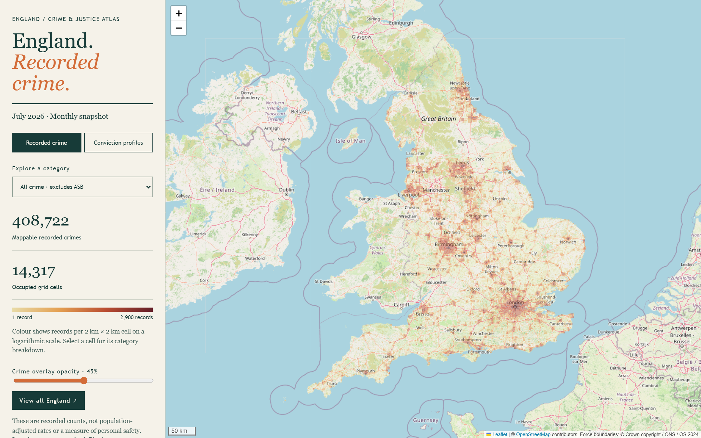
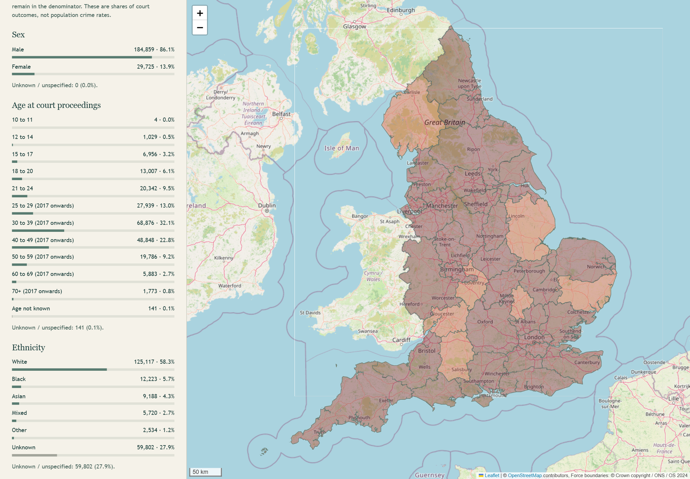
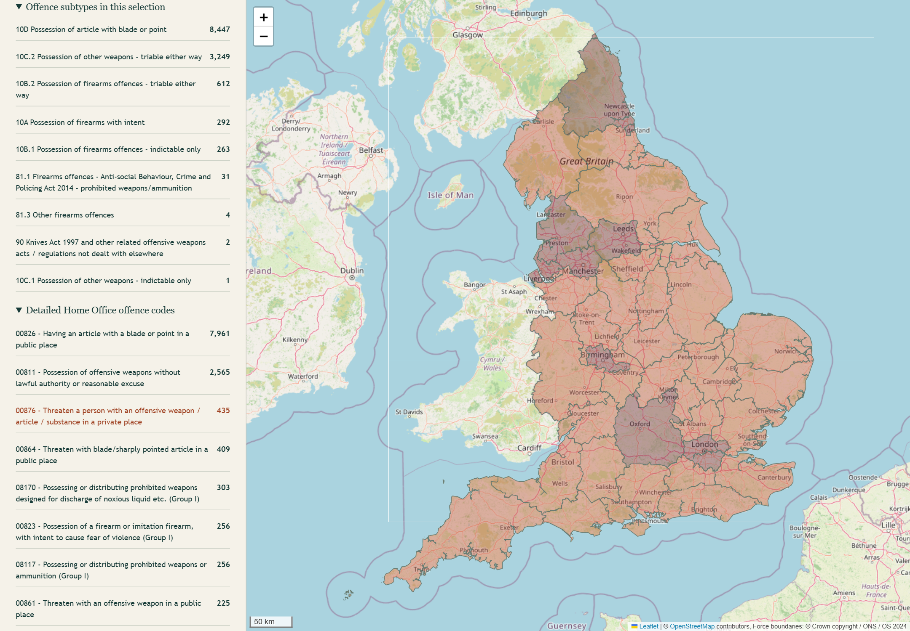
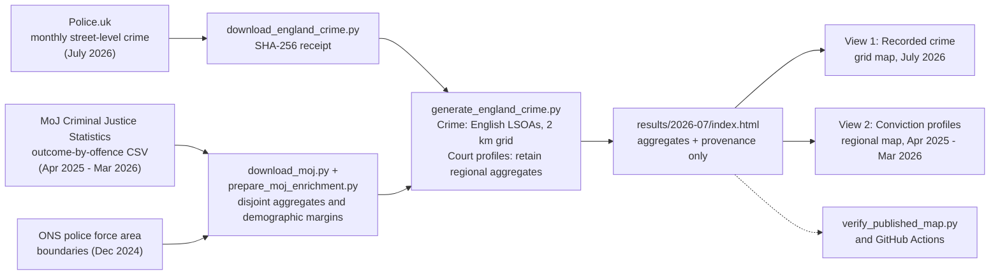

# England Crime Atlas

**Where crime was recorded. What courts concluded.**

Explore July 2026 police records alongside a separate view of court outcomes from April 2025 to March 2026.

An interactive, self-contained map of recorded crime in England, plus a regional view of convicted-person demographics (sex, age, ethnicity) and detailed legal offences, including weapon offences. Built from Police.uk, Ministry of Justice (MoJ) and ONS open data by **CompleteTech LLC AI Research**.

[](results/2026-07/index.html)

<sub>Screenshot of the running application: July 2026 recorded crime (excluding anti-social behaviour) on a 2 km grid. Blank areas are not evidence of zero crime; see [coverage gaps](#limitations).</sub>

## Why explore it

- **See the geography of recorded crime.** 408,722 mappable July 2026 records (excluding anti-social behaviour) in 2 km British National Grid cells. Pick a category, click a cell for its breakdown, fade the overlay to read roads and place names.
- **See court outcomes separately.** Regional conviction profiles for April 2025–March 2026, with sex, age at proceedings, ethnicity, quarterly outcomes and Home Office offence codes, for 38 English police force areas.
- **Drill into legal offence detail.** 325 offence subtypes and 867 detailed codes are available; one button jumps to the weapon offences (nine subtypes, 40 codes with convictions in the period).
- **Everything is inspectable.** The published map embeds only aggregate counts and simplified boundaries, and ships with provenance receipts and an independent reconciliation.

## Incidents are not court outcomes

The two views are deliberately kept apart. Do not combine them.

| | Recorded crime | Conviction profiles |
| --- | --- | --- |
| **Source** | Police.uk street-level crime | MoJ Criminal Justice Statistics Quarterly (March 2026) |
| **Period** | July 2026 | April 2025 – March 2026 |
| **Unit** | A crime record, in a 2 km grid cell | A conviction *occasion* for a person (principal-offence basis), per police force area |
| **Geography** | Anonymised approximate location | Published court-statistics force area, not offender residence or crime location |
| **Linkage** | – | No link from any mapped incident to any offender |

## Feature showcase

### Convicted-person demographics by region

<a href="results/2026-07/index.html"></a>

Each chart is a separate marginal distribution of the same selected total; they cannot be cross-tabulated. Unknowns stay in the denominator: in the default indictable view, ethnicity is unknown for 27.9% of occasions, and the tool shows that rather than hiding it.

<sub>Actual application screenshot: April 2025–March 2026 court outcomes, all published English areas, indictable offences. These are shares of conviction occasions, not population crime rates.</sub>

### Weapon offences, by legal code

<a href="results/2026-07/index.html"></a>

The weapon group has 12,901 conviction occasions in the default indictable view. The list also includes threats, intent, supply and marketing offences, so read the full code label. Codes identify legal categories: a generic "offensive weapon" code does not say whether the item was a knife, a bat or something else.

<sub>Actual application screenshot: April 2025–March 2026 weapon-offence court outcomes. Counts are conviction occasions, not distinct people.</sub>

## Architecture



The two views share one page but not data: they are never joined.

## Quick start

Requires Python 3 (only the standard library is needed to view the map). Internet access is needed for the Leaflet library and OpenStreetMap tiles.

```bash
git clone https://github.com/CompleteTech-LLC-AI-Research/england-crime-atlas.git
cd england-crime-atlas
python -m http.server 8766 --bind 127.0.0.1 --directory results
```

Open **http://127.0.0.1:8766/2026-07/index.html** (use another port if 8766 is taken). Serve over localhost so tile requests carry a web referrer; opening the file directly can cause the basemap to be refused. GitHub's file browser shows the HTML as source, not a rendered page.

Then: choose a category, click a grid cell, switch to **Conviction profiles**, select a force area, and try **Explore weapon offences**.

### Rebuild from source

Requires Python 3.10+. No API keys or paid services.

```powershell
python -m venv .venv
.\.venv\Scripts\Activate.ps1
python -m pip install -r requirements.txt
python src/download_england_crime.py --month 2026-07
python src/download_moj.py
python src/prepare_moj_enrichment.py
python src/generate_england_crime.py --input data/england-crime-2026-07.zip --output-dir results/2026-07 --convictions data/moj-convictions-2026.json
python src/verify_moj_enrichment.py
python src/verify_published_map.py
```

On macOS/Linux use `source .venv/bin/activate` and `python3`. Omit `--month` for the latest Police.uk month (and update the later paths). The MoJ downloader pins the March 2026 publication. Publishers can revise downloads, so reruns may not be byte-for-byte identical. Raw archives and intermediate data are git-ignored.

## Methodology

- **Recorded crime.** Police.uk street-level records for July 2026. England membership uses source LSOA codes beginning `E01`; records without an LSOA cannot be assigned and are excluded. Published locations are anonymised approximations, and 2 km cells can cross country borders. Of 549,512 source rows, 496,343 were mapped; 408,722 excluding anti-social behaviour (ASB), with an optional ASB layer adding 87,621.
- **Convictions.** MoJ outcome-by-offence data, latest year (April 2025–March 2026). Counts are conviction *occasions* on a principal-offence basis; only records classified as persons are included (companies, public bodies and unknown person status are excluded). The default view (indictable-only and triable-either-way offences) has 214,584 occasions; all offences has 820,587. Ethnicity is poorly recorded for summary offences.
- **Boundaries.** ONS December 2024 police force areas, simplified. City of London has no separate published profile in this extract and is shown as unavailable.

## Limitations

Please read these before quoting any number.

- **Counts are not rates.** They are not adjusted for population, footfall or reporting behaviour, and are not safety ratings. Do not divide court counts by July crime counts to derive conviction rates.
- **Missing data is not zero crime.** July files were missing for British Transport Police, Gloucestershire, Greater Manchester and North Yorkshire. Blank areas may reflect that, or records without a usable location.
- **Different periods.** Incidents are July 2026; court outcomes are April 2025–March 2026, by completion date.
- **Occasions, not people.** One person can appear on several occasions; there are no unique-person counts.
- **No individual linkage.** Demographics describe convicted persons in a force area's court statistics. They cannot be attributed to individual mapped crimes, grid cells or neighbourhoods.
- **Regions only.** The force area is the court-statistics geography, not residence or crime location. Welsh force areas and records with unknown area are excluded from the English view.
- **Unknowns stay visible.** Unknown values remain in each chart's denominator. Charts are separate margins and must not be added or read as intersections.
- **Weapon codes are legal categories.** They may not identify the physical weapon, and the weapons group includes threats, intent, supply and marketing offences.

## Verification

- The MoJ CSV was independently re-read to reconcile all 38 English area totals and all 40 weapon-code totals (12,901 occasions); all 60,190 demographic margins matched.
- Browser checks covered offence groups, weapon codes, regional profiles, fiscal-quarter ordering, missing-area handling, demographic charts, basemap visibility and switching back to the July crime counts.
- GitHub Actions runs `python src/verify_published_map.py` and a syntax check on every push, confirming the published data and metadata agree. It does not validate statistical representativeness or infer missing records.

Provenance: [crime and run receipt](results/2026-07/run_metadata.json) · [court-data receipt](results/2026-07/convictions_metadata.json) · [independent verification](results/2026-07/enrichment_verification.json)

## Sources and attribution

- [Police.uk data downloads](https://data.police.uk/data/), [about/definitions](https://data.police.uk/about/) and [known data issues](https://data.police.uk/changelog/)
- [MoJ Criminal Justice Statistics Quarterly: March 2026](https://www.gov.uk/government/statistics/criminal-justice-statistics-quarterly-march-2026) and its [technical guide](https://assets.publishing.service.gov.uk/media/6a689bd8f938595f17d020ec/criminal-justice-statistics-technical-guide-Q1-2026.pdf)
- [ONS December 2024 Police Force Areas boundaries](https://services1.arcgis.com/ESMARspQHYMw9BZ9/arcgis/rest/services/Police_Force_Areas_Dec_2024_EW_BGC/FeatureServer)
- Basemap © [OpenStreetMap contributors](https://www.openstreetmap.org/copyright); rendered with [Leaflet](https://leafletjs.com/)

Police.uk and MoJ data contain public sector information under the [Open Government Licence v3.0](https://www.nationalarchives.gov.uk/doc/open-government-licence/version/3/). Boundaries contain OS and National Statistics data © Crown copyright and database right 2024. Full details: [DATA_LICENSES.md](DATA_LICENSES.md).

## Contribute or share

Feedback that would help most: a statistic that is worded in a way that could mislead, a coverage gap we have not documented, or a clearer way to show uncertainty. Please open an issue with the view, selection and what you expected. When sharing a screenshot, include the period and the "not a rate" caveat with it.

---

A project by **CompleteTech LLC AI Research**. Screenshots in `docs/assets/` were captured from the running application at `results/2026-07/index.html`.


## Bristol camera pilot (local)

A locally enriched viewer includes a **Bristol · CCTV pilot** under Recorded crime. Select **Explore Bristol** to show 1,064 distinct published positions from 1,513 council source records, including some South Gloucestershire positions. Records sharing coordinates are grouped; positions are not a count of physical camera units.

Click a crime cell for the listed-position count. The pilot relates positions to the existing 2 km grid: 48 occupied cells contain listed positions, with 6,558 July crime records across those entire cells, excluding ASB. This is co-location, not a count of offences captured on camera.

Optional 25–250 m proximity circles show how assumed distances intersect. They are **not viewing areas**. Actual direction, field of view, range, installation dates, outages and footage-use outcomes are unavailable. Current positions cannot establish July 2026 camera availability. Missing positions mean unknown camera presence. Investigation effectiveness is not assessable from this inventory.

Source: [Bristol council CCTV page](https://www.bristol.gov.uk/residents/crime-and-emergencies/cctv-in-bristol) and its [public camera layer](https://maps1.bristol.gov.uk/server/rest/services/Pinpoint125/MapServer/30). Retrieved 30 September 2026. No explicit reuse licence was found on the layer or portal item, so this snapshot is a local pilot pending clarification before public redistribution.

Reproduce locally after installing `requirements.txt`:

```powershell
python src/prepare_camera_enrichment.py --output data/bristol-cameras.json
New-Item -ItemType Directory -Force results/output-camera-pilot/2026-07
Copy-Item results/2026-07/* results/output-camera-pilot/2026-07/
python src/attach_camera_enrichment.py --map results/output-camera-pilot/2026-07/index.html --cameras data/bristol-cameras.json
python src/verify_camera_enrichment.py
```

A full crime rebuild accepts `--cameras data/bristol-cameras.json`. The raw camera response stays under ignored `data/cameras/`; its SHA-256 is recorded in `cameras_metadata.json`. The existing crime and court verification remains independent.

The committed viewer contains no Bristol camera snapshot. Local enrichment is stored in ignored `results/output-camera-pilot/`; when serving `results`, open `/output-camera-pilot/2026-07/index.html`.
